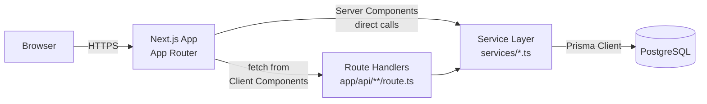
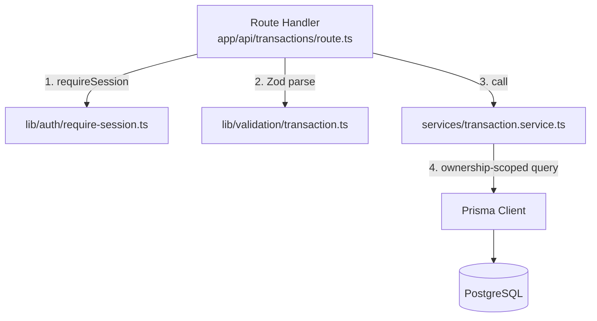
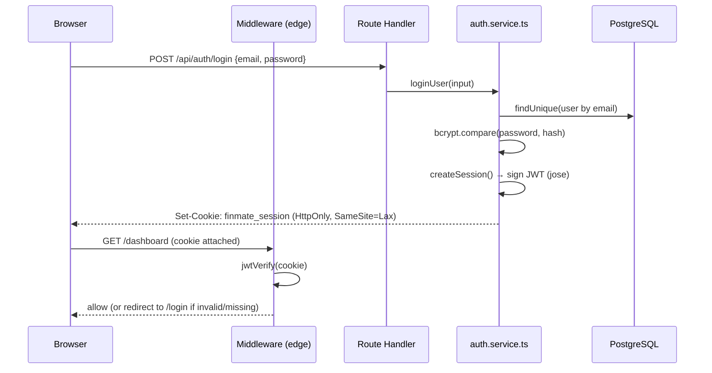
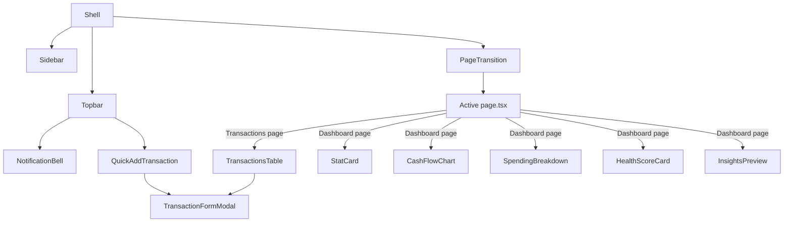
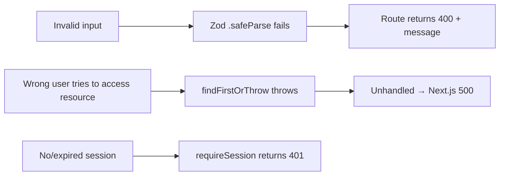
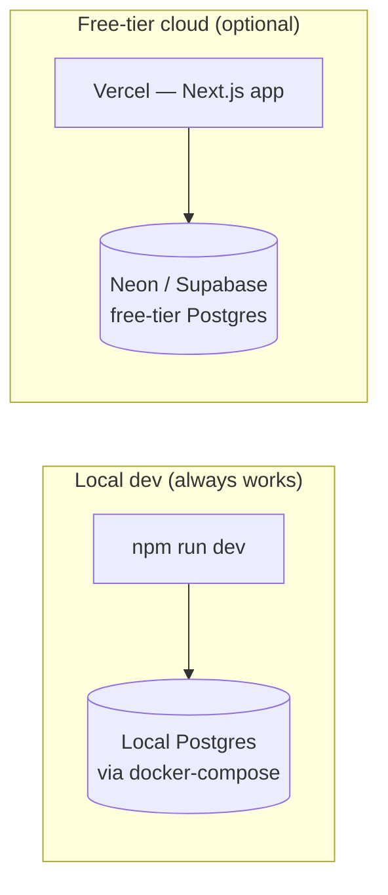

# FinMate — Architecture

## Table of Contents
- [High-level architecture](#high-level-architecture)
- [Frontend architecture](#frontend-architecture)
- [Backend architecture](#backend-architecture)
- [Database architecture](#database-architecture)
- [Authentication flow](#authentication-flow)
- [API request lifecycle](#api-request-lifecycle)
- [State management](#state-management)
- [Component relationships](#component-relationships)
- [Data flow](#data-flow)
- [Error flow](#error-flow)
- [Validation flow](#validation-flow)
- [Security boundaries](#security-boundaries)
- [Deployment architecture](#deployment-architecture)

---

## High-level architecture

FinMate is a **single Next.js 15 application** serving as both frontend and backend — a
monolith, deliberately. There is no separate API service, no microservices, and no message
queue. See [`ENGINEERING_DECISIONS.md`](./ENGINEERING_DECISIONS.md) for why this is the
correct choice at this scale, and [`SYSTEM_DESIGN.md`](./SYSTEM_DESIGN.md) for when it
would stop being sufficient.



Two paths into the service layer exist, and both are real, not aspirational:

1. **Server Components** (e.g. `app/(app)/dashboard/page.tsx`) call service functions
   directly during server-side rendering — no HTTP round trip, no serialization overhead.
2. **Client Components** (e.g. `TransactionsTable`) call the REST API routes via `fetch`,
   which validate the request, then call the same service functions.

## Frontend architecture

- **App Router with route groups.** All authenticated sections (`dashboard`, `transactions`,
  `budgets`, `goals`, `accounts`, `recurring`, `insights`, `settings`) live under
  `app/(app)/` and share a single `layout.tsx`. This was a deliberate fix, not the original
  structure — see the [Engineering challenge](#the-shared-layout-fix) below.
- **Server Components by default.** Pages fetch their initial data server-side (no loading
  spinner on first paint for that data).
- **Client Components only where interactivity is required** — forms, modals, charts
  (Recharts requires a browser), and anything using `useState`/`useEffect`.
- **Design system** in `components/ui/` (`Button`, `Card`, `Input`, `Badge`, `Progress`,
  `Skeleton`, `EmptyState`) — every feature component composes these rather than writing
  ad hoc markup.
- **No global client state library.** State is local `useState` per component; data is
  re-fetched via `fetch` in `useEffect` on mount. This is a genuine architectural
  simplicity/trade-off — see [State management](#state-management) below.

## Backend architecture



Every mutating route follows the same four-step pattern: authenticate → validate → delegate
to a service function → return a typed JSON response. Business logic — including the
account-balance side effects of creating/editing/deleting a transaction — lives entirely in
`services/`, never inline in a route handler.

## Database architecture

PostgreSQL, accessed exclusively through Prisma Client (no raw SQL in the codebase). Full
schema documentation is in [`DATABASE.md`](./DATABASE.md).

## Authentication flow



## API request lifecycle

1. Client component calls `fetch("/api/transactions", { method: "POST", body })`.
2. Route Handler calls `requireSession()` — returns 401 immediately if no valid session cookie.
3. `transactionSchema.safeParse(body)` — returns 400 with a specific message if invalid.
4. `createTransaction(userId, parsedData)` runs inside `prisma.$transaction(...)` — creates the transaction row *and* adjusts the owning account's balance atomically.
5. Route Handler returns the created record as JSON with a `201` status.
6. Client component updates local state and calls its `load()` function to refresh the list from the server (no optimistic update currently — see `ROADMAP.md`).

## State management

There is **no Redux, Zustand, Jotai, or React Query** in this codebase — a deliberate
decision, not an oversight. Every data-driven client component:

```tsx
const [data, setData] = useState<T[]>([]);
const [loading, setLoading] = useState(true);

useEffect(() => {
  fetch("/api/resource").then(r => r.json()).then(d => setData(d.items)).finally(() => setLoading(false));
}, []);
```

This pattern repeats across `TransactionsTable`, `BudgetBoard`, `GoalsBoard`,
`AccountsBoard`, `RecurringBoard`, `InsightsList`, `CashFlowChart`, `SpendingBreakdown`,
`HealthScoreCard`, `InsightsPreview`, and `NotificationBell` — 11 independent fetch
call-sites, each with its own loading state, and **no deduplication** between them. This is
the single biggest, most honest architectural gap for anyone asking "why doesn't this use
React Query?" — the answer is scope and time, not a considered rejection of the tool. See
`ROADMAP.md` P1.

## Component relationships



## Data flow

Server Component pages fetch data once, server-side, on navigation (via the service layer
directly). Client Components inside those pages independently fetch their own slice of data
via the API routes on mount. This means a single page load can trigger both a server-side
Prisma query (for the page shell) *and* several client-side `fetch` calls (for widgets) —
this is normal Next.js App Router behavior, not a bug, but it does mean the "one query per
page" mental model does not hold for pages with several client-rendered widgets (the
dashboard, most notably).

## Error flow



**Honest gap:** the `findFirstOrThrow` ownership check in service functions (e.g.
`updateTransaction`, `deleteGoal`) throws a raw Prisma error if the record doesn't belong to
the requesting user, which is *not* explicitly caught in every route handler — it currently
surfaces as a generic 500 rather than a clean 403/404. This is flagged as a fix in
`ROADMAP.md`.

## Validation flow

Every mutation endpoint uses a Zod schema from `lib/validation/*.ts` — the same schema
shape is reused for client-side form hints (via `react-hook-form` + `@hookform/resolvers`
where wired up) and server-side enforcement, so validation rules cannot drift between client
and server.

## Security boundaries

- **Edge middleware** (`middleware.ts`) is the first boundary — unauthenticated requests to any protected route are redirected before a React Server Component ever renders.
- **Route Handler `requireSession()`** is the second boundary for the API surface.
- **Service-layer ownership checks** (`where: { id, userId }`) are the third and most important boundary — this is what actually prevents User A from reading or modifying User B's data, even if they guess a valid resource ID.
- **What is *not* a boundary today:** there is no rate limiting, so the auth endpoints are not defended against brute-force at the network layer — see `SECURITY.md`.

## Deployment architecture



The application is designed so the free cloud path is optional, not required — local
development with `docker-compose.yml` always works regardless of any third party's free-tier
policy changes. See `DEPLOYMENT.md` in the repository root for the step-by-step cloud path.
