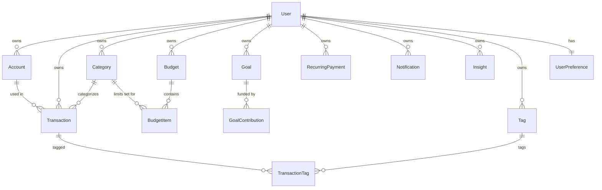

# FinMate — Database Documentation

PostgreSQL, accessed exclusively through Prisma Client. 14 models, 7 enums. Schema source
of truth: `prisma/schema.prisma`.

## Table of Contents
- [Why PostgreSQL](#why-postgresql)
- [Entity relationship overview](#entity-relationship-overview)
- [Models](#models)
- [Indexing strategy](#indexing-strategy)
- [Monetary data & precision — the honest discussion](#monetary-data--precision--the-honest-discussion)
- [Transaction consistency](#transaction-consistency)
- [Normalization decisions](#normalization-decisions)
- [Potential performance bottlenecks](#potential-performance-bottlenecks)
- [How the schema could scale](#how-the-schema-could-scale)

## Why PostgreSQL

Financial data has real relational integrity requirements — a `Transaction` must belong to
exactly one `Account` and one `User`; deleting an `Account` should cascade sensibly; a
`Budget` and its `BudgetItem`s must stay consistent. A relational database with foreign-key
constraints enforces this at the database layer, not just in application code. PostgreSQL
specifically was chosen over MySQL for its more standards-compliant `DECIMAL` type behavior
and because genuinely free managed tiers exist (Neon, Supabase) alongside a trivial local
Docker setup — see `ENGINEERING_DECISIONS.md`.

## Entity relationship overview



## Models

### User
**Purpose:** account identity and top-level preferences.

| Field | Type | Notes |
|---|---|---|
| id | String (cuid) | Primary key |
| name | String | |
| email | String | `@unique`, indexed |
| passwordHash | String | bcrypt hash, never the plain password |
| currency | String | Default `"INR"` |
| monthlyIncome | Decimal(14,2)? | Optional, set during onboarding |
| onboarded | Boolean | Gates whether `/onboarding` redirects to `/dashboard` |
| isDemo | Boolean | Flags the seeded demo account |

**Relationships:** owns everything else in the schema, 1:many except `UserPreference` (1:1).
**Index:** `@@index([email])` — supports the login lookup.

### UserPreference
**Purpose:** theme, currency, and per-notification-type opt-in/out. 1:1 with `User`
(`@unique` on `userId`).

### Account
**Purpose:** a bank/savings/cash/credit-card/investment account with a running balance.

| Field | Type | Notes |
|---|---|---|
| type | AccountType enum | `BANK`, `SAVINGS`, `CASH`, `CREDIT_CARD`, `INVESTMENT` |
| balance | Decimal(14,2) | Kept in sync by every transaction's create/update/delete — see [Transaction consistency](#transaction-consistency) |

**Index:** `@@index([userId])`.

### Category
**Purpose:** user-scoped expense/income categories (Food, Shopping, Transport, etc.).
Seeded with 10 defaults on registration (`isDefault: true`), but users can add their own.

**Constraint:** `@@unique([userId, name])` — a user cannot have two categories with the same
name, but two different users can both have a "Food" category (correctly, since categories
are per-user, not global).

### Tag / TransactionTag
**Purpose:** optional free-form tagging on transactions, many-to-many via the
`TransactionTag` join table (composite primary key `[transactionId, tagId]` — the standard
Prisma pattern for join tables).

### Transaction
**Purpose:** the core financial record.

| Field | Type | Notes |
|---|---|---|
| amount | Decimal(14,2) | Always stored positive; sign is derived from `type` at read/write time, not stored |
| type | TransactionType enum | `INCOME`, `EXPENSE`, `TRANSFER` |
| categoryId | String? | Nullable — a transaction can be uncategorized |
| date | DateTime | User-supplied transaction date (distinct from `createdAt`) |

**Indexes:** `@@index([userId, date])` (supports the transactions list, sorted/filtered by
date), `@@index([userId, categoryId])` (supports category-breakdown aggregation),
`@@index([accountId])`.

### Budget / BudgetItem
**Purpose:** one `Budget` per user per calendar month (`@@unique([userId, month, year])`),
containing one `BudgetItem` per category with a spending `limit`. `BudgetItem.status`
(`HEALTHY`/`WARNING`/`EXCEEDED`) is a **cached, recomputed value** — the source of truth is
always a live `SUM(amount)` query against `Transaction` for that category/month
(`services/budget.service.ts`); `status` is written back to the row only as an optimization
for other reads, not trusted blindly.

**Constraint:** `@@unique([budgetId, categoryId])` — one limit per category per budget.

### Goal / GoalContribution
**Purpose:** a savings target with a running `currentAmount`, incremented atomically by each
`GoalContribution` inside `prisma.$transaction` (`services/goal.service.ts`).

### RecurringPayment
**Purpose:** tracked subscriptions/bills. **Honest gap:** `nextDueDate` is not automatically
advanced by any scheduled job — there is no background worker in this codebase. Advancing it
would currently require a manual update or a cron-triggered API route (see `ROADMAP.md`).

### Notification / Insight
**Purpose:** both are append-only, user-scoped, timestamp-indexed logs generated from live
state by `notification.service.ts` and `insight.service.ts` respectively — neither is
user-created data.

## Indexing strategy

Every foreign key that is queried by (`userId` on almost every model) has an index. The two
compound indexes worth calling out specifically:

- `Transaction @@index([userId, date])` — the transactions list is always filtered by user and sorted by date; a compound index serves both in one lookup instead of a full table scan + sort.
- `Transaction @@index([userId, categoryId])` — the spending-by-category aggregation (`analytics.service.ts`) groups by category within a user's data; without this index that query would degrade linearly with total transaction count across *all* users, not just the current one.

**Gap:** no index exists on `Transaction.date` alone (without `userId`) — acceptable today
since every real query is user-scoped, but worth knowing if a future admin/analytics feature
needed to query across all users by date range.

## Monetary data & precision — the honest discussion

**What is done correctly:** every monetary column in the schema uses Prisma's
`Decimal(14,2)` type, which maps to PostgreSQL's `NUMERIC(14,2)` — an exact, base-10 decimal
type, not IEEE-754 floating point. This means values are stored and retrieved from the
database without floating-point representation error.

**The real gap, stated plainly:** Prisma's `Decimal` values are represented as a
`Prisma.Decimal` object in JavaScript, but several places in the service layer convert them
to native JS `number` before doing arithmetic — for example, in
`services/transaction.service.ts`:

```ts
function signedAmount(type: TransactionType, amount: number): number {
  return type === "EXPENSE" ? -Math.abs(amount) : Math.abs(amount);
}
// called with: signedAmount(input.type, input.amount) where input.amount is already `number`
```

and in `services/goal.service.ts`:

```ts
data: { currentAmount: Number(goal.currentAmount) + input.amount }
```

`Number(goal.currentAmount) + input.amount` performs the addition in native JS floating
point *before* handing the result back to Prisma to store as `Decimal`. For two-decimal
currency values this is extremely unlikely to produce a visible rounding error in practice
(JS floats are exact for the vast majority of two-decimal sums within normal transaction
sizes), but it is not the theoretically correct approach, and an interviewer asking "how do
you guarantee financial precision?" deserves the honest answer above, not a claim that
`Decimal` alone solves it end-to-end.

**The correct fix** (tracked in `ROADMAP.md` P0): use `Prisma.Decimal`'s own arithmetic
methods (`.plus()`, `.minus()`) throughout the service layer instead of converting to
`number`, so the entire read → compute → write path stays in exact decimal arithmetic.

## Transaction consistency

Two service functions use `prisma.$transaction(...)` to guarantee atomicity:

1. **`createTransaction` / `updateTransaction` / `deleteTransaction`** (`transaction.service.ts`) — creating, editing, or deleting a `Transaction` and adjusting the owning `Account.balance` happen inside one database transaction. If the balance update fails, the transaction row is not created either (or vice versa) — no partial state is possible.
2. **`addContribution`** (`goal.service.ts`) — creating a `GoalContribution` row and incrementing `Goal.currentAmount` happen atomically.

**Gap:** neither of these uses explicit row-level locking (`SELECT ... FOR UPDATE`) or
optimistic concurrency control (a version column). Under concurrent requests modifying the
*same* account or goal simultaneously, Postgres's default `READ COMMITTED` isolation level
inside `prisma.$transaction` prevents corruption but does not prevent a classic
lost-update race in every scenario — see `SYSTEM_DESIGN.md` for how this would be hardened
at scale.

## Normalization decisions

The schema is in 3NF throughout — no repeating groups, no derived data stored as a source of
truth except the two explicitly-cached-and-recomputed fields called out above
(`BudgetItem.status`, and account `balance` itself, which is a running total rather than
being summed from transactions on every read for performance reasons — a deliberate
denormalization, not an oversight).

## Potential performance bottlenecks

- **`Account.balance` as a running total** means every transaction write is also an account write — correct for read performance (no need to sum all transactions to show a balance), but means account rows are contended under high write concurrency to the same account. Acceptable at personal-finance-app scale (one user, a handful of accounts); would need row-level locking language at higher concurrency.
- **Category and Insight/Notification growth is unbounded per user** — there is currently no archival or pagination on `Insight`/`Notification` beyond `take: 20` / `take: 50` limits in the service queries; this caps query cost but means old records accumulate indefinitely.

## How the schema could scale

For the realistic growth path this project would face (see `PERFORMANCE.md` for the
100 → 1M user analysis), the schema itself would not need to change significantly before
100,000 users — the indexes already in place cover the actual query patterns. What would
need to change is *infrastructure* around the same schema: connection pooling (PgBouncer),
read replicas for analytics queries, and eventually partitioning the `Transaction` table by
date range if a single user's history grew into the tens of thousands of rows (uncommon for
a personal finance tool, but not impossible over many years of use).
