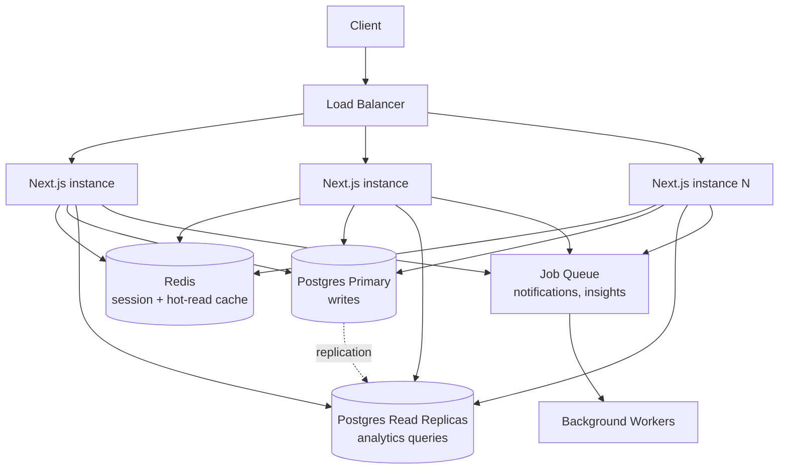
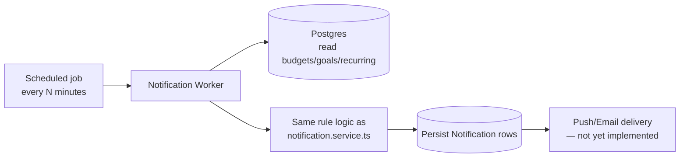
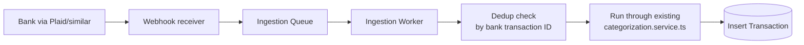

# FinMate — System Design Practice

Realistic system-design interview answers grounded in FinMate's actual shape, honest about
what's already built versus what would need to be added.

## Table of Contents
1. [Design FinMate for 1 million users](#1-design-finmate-for-1-million-users)
2. [Design a financial transaction system](#2-design-a-financial-transaction-system)
3. [Design a personal finance dashboard](#3-design-a-personal-finance-dashboard)
4. [Design a notification system](#4-design-a-notification-system)
5. [Design a transaction ingestion pipeline](#5-design-a-transaction-ingestion-pipeline)
6. [Design analytics for financial data](#6-design-analytics-for-financial-data)
7. [Design secure authentication for FinMate](#7-design-secure-authentication-for-finmate)

---

## 1. Design FinMate for 1 million users

### Requirements
**Functional:** account/transaction CRUD, budgets, goals, recurring payments, dashboard
analytics, insights, notifications — the existing feature set, unchanged.
**Non-functional:** p95 API latency under ~300ms, no single point of failure for the
database, financial-data consistency must never be sacrificed for availability.

### Scale assumptions
1M users, average ~50 transactions/user/month → ~50M transaction writes/month (~19
writes/second average, with real-world peak multiples on top of that — evenings/weekends
in a consumer finance app). Reads dominate writes heavily (dashboard views, transaction
list browsing) — a realistic 20:1 or higher read:write ratio.

### Architecture at this scale

- **Multiple stateless app instances** behind a load balancer — the current codebase is
  already stateless (session lives in a signed cookie, not server memory), so this requires
  no architectural change to the app itself, only infrastructure.
- **Read replicas** for the analytics endpoints specifically (`cash-flow`, `spending`,
  `summary`, `health-score`) — these tolerate slightly stale data (seconds of replication
  lag is invisible to a user looking at "this month's spending").
- **Redis** for two things: rate-limiting state shared across instances (an in-memory
  limiter, correct at 1 instance, breaks the moment there's more than one), and caching
  read-heavy, rarely-changing data (category lists, user preferences).
- **A job queue** (SQS or similar) moves notification/insight generation out of the
  request-time side effect it currently is (see `API.md`) into scheduled background work —
  genuinely justified at this scale, unlike at 100 users.

### API design
Unchanged REST shape — versioned as `/api/v1/` at this point since a public/mobile client
becomes plausible at this scale. Pagination added to every list endpoint (currently only
transactions paginate).

### Data model
Unchanged schema, with the `RecurringPayment.categoryName` denormalization fix (proper FK)
and the `Goal.currentAmount` atomic-increment fix (see `DATABASE_INTERVIEW.md`) applied —
both are correctness issues worth fixing regardless of scale, but become more visible under
real concurrency.

### Caching
Cache-aside pattern: check Redis first for category lists/preferences, fall through to
Postgres on a miss, write back to cache with a short TTL. Analytics aggregates could be
cached per-user with a TTL of a few minutes, invalidated eagerly on new transaction writes
for that user.

### Failure handling
- Database primary failure → automated failover to a standby (managed Postgres providers
  handle this) — the app itself needs a retry-with-backoff on connection errors, not
  currently implemented.
- Queue worker failure → messages remain in the queue for reprocessing (standard
  at-least-once delivery); notification/insight generation is naturally idempotent-safe if
  deduplicated by a stable key (already the pattern used for insights — deduplicated by
  `metric` per day).

### Monitoring
p50/p95/p99 latency per endpoint, database connection-pool saturation, queue depth and
processing lag, error rate by endpoint — none of this is currently instrumented in the
actual codebase; this is what I'd add first, before any other scaling work, since you
can't correctly prioritize scaling changes without knowing where the actual bottleneck is.

### Security
Rate limiting (Redis-backed, shared across instances) becomes non-optional at this scale —
already the top-priority gap even at current scale, but a single-instance in-memory limiter
wouldn't even be architecturally possible once there are multiple app instances.

### Trade-offs
Explicitly **not** adding: microservices (no part of this domain has a genuinely different
scaling profile from the rest — a transactions service and a budgets service would still
need to share the same user/account data model, making the split mostly organizational
rather than technical), GraphQL (still not needed — the same single first-party client
consumes this API), Kafka (a simpler queue like SQS is sufficient for the actual
notification/insight workload volume here — Kafka's value is in high-throughput,
multi-consumer streaming, which doesn't describe this workload).

---

## 2. Design a financial transaction system

### Requirements
Every transaction must atomically update the owning account's balance; must never lose or
duplicate a transaction; must support editing/deleting with correct balance reversal.

### Current implementation (already built)
`services/transaction.service.ts`'s `createTransaction`/`updateTransaction`/
`deleteTransaction` each wrap both the transaction-row write and the account-balance
adjustment in one `prisma.$transaction` — this is a real, working implementation of
exactly this requirement at the current scale, not a hypothetical design.

### What would need to be added at higher concurrency
- **Idempotency keys** on the create endpoint — a client retry after a network timeout
  currently has no way to know if the original request actually succeeded, risking a
  duplicate transaction. Fix: accept a client-generated idempotency key, store it with a
  short-lived uniqueness constraint, and return the original result on a repeat.
- **Atomic balance updates** — replace the current read-then-write pattern
  (`Number(existing.balance) + delta`) with Prisma's `{ increment: delta }` syntax, pushing
  the arithmetic into a single atomic SQL statement rather than an application-level
  read-modify-write (same fix as the `Goal.currentAmount` race condition discussed in
  `DATABASE_INTERVIEW.md`).
- **Audit log** — a separate append-only `TransactionAudit` table recording every
  create/edit/delete with a timestamp and the actor, for dispute resolution — does not
  exist today.

### Data model
`Transaction(id, userId, accountId, categoryId?, merchant, amount: Decimal, type, date)`,
already exactly this shape in the real schema.

---

## 3. Design a personal finance dashboard

### Requirements
Show total balance, income/expenses/savings for the current month with month-over-month
comparison, a cash-flow trend chart, and a category breakdown — all reflecting real,
current data.

### Current implementation
`services/analytics.service.ts`'s `getMonthSummary`, `getCashFlow`, and
`getSpendingByCategory` compute all of this live from `Transaction`/`Account` aggregate
queries on every request — genuinely real-time, not a precomputed/cached snapshot, at the
cost of doing real aggregation work on every dashboard load.

### At scale, what changes
Move from "compute live on every request" to "compute on write, cache the result" — e.g.,
maintain a small `MonthlySummary` materialized-view-style table, updated incrementally
whenever a transaction affecting the current month is created/edited/deleted, rather than
re-summing the full month's transactions on every dashboard view. This is the honest
answer to "how would this dashboard perform for a user with 10 years of transaction
history" — today, `getMonthSummary` only aggregates the current and previous month
specifically (not full history), which limits the blast radius of this concern
considerably already.

---

## 4. Design a notification system

### Requirements
Notify users of budget warnings, goal milestones, upcoming recurring payments, and a
monthly summary.

### Current implementation
`services/notification.service.ts`'s `refreshNotifications` — triggered lazily by
`GET /api/notifications`, checks current budget status and upcoming recurring payments,
deduplicates against notifications already created "today" by title, and persists new
ones. **Honest limitation named directly here:** this only runs when a user actively opens
the Notifications view — there's no proactive delivery (no email, no push notification, no
scheduled check) today.

### Production design

The rule logic itself doesn't need to change — it's already correctly separated into
`notification.service.ts` as pure business logic independent of how it's triggered. What
changes is *when* it runs: a scheduled job (cron, or a queue-triggered worker) instead of a
side effect of a GET request, plus an actual delivery mechanism (email via a free-tier
provider like Resend, or web push) which doesn't exist today at all — in-app only.

---

## 5. Design a transaction ingestion pipeline

**Honest framing:** FinMate has no ingestion pipeline today — every transaction is
manually entered by the user through the UI, by design (avoiding the cost and complexity
of bank-linking aggregators like Plaid). This question is worth answering as "here's how
I'd design it if this requirement were added," not as a description of existing code.

### If bank-linking were added

The existing `categorization.service.ts` (deterministic merchant-name matching) would
plug in directly as the categorization step — no change needed there. The new work would be
the webhook receiver, a queue to absorb bursty webhook delivery, and a deduplication check
against the bank's own transaction ID (to handle the bank re-sending the same webhook,
which real payment providers do).

---

## 6. Design analytics for financial data

### Current implementation
Real-time aggregation via Prisma `groupBy`/`aggregate` queries against the live
`Transaction` table — genuinely accurate, at the cost of recomputing on every request (see
`PERFORMANCE.md`).

### At scale
A common pattern: pre-aggregate into a summary table on write (incrementally updating a
per-user-per-month-per-category running total whenever a transaction changes), falling
back to the live aggregation query only for the current, still-changing month. This trades
some write-path complexity for dramatically cheaper read-path performance for historical
months, which never change after the fact.

---

## 7. Design secure authentication for FinMate

### Current implementation (real, already built)
bcrypt password hashing (cost 12) + signed JWT in an HttpOnly/SameSite=Lax cookie,
verified by edge middleware — see `ARCHITECTURE.md`'s auth sequence diagram and
`SECURITY.md` for the full honest breakdown of what's implemented versus gapped.

### Hardening for production scale
- **Session revocation:** add a `sessionVersion` column on `User`, embed it in the JWT,
  bump it on logout/password change, check against the current DB value (cached in Redis
  to avoid a DB round trip on every request) — turns the currently-stateless,
  unrevokable JWT into an effectively revokable one without losing the stateless
  verification benefit for the common case.
- **Rate limiting:** Redis-backed token bucket on `/api/auth/login` and
  `/api/auth/register`, shared across all app instances — the top-priority fix, and the
  one that specifically requires Redis (an in-memory limiter doesn't work once there's more
  than one app instance).
- **Refresh-token rotation:** short-lived (e.g., 15-minute) access token + longer-lived,
  rotating refresh token, instead of today's single 7-day token — reduces the exposure
  window of a stolen token considerably.
- **Account lockout:** after N failed attempts, temporarily lock the account (with a clear
  unlock path, to avoid enabling a denial-of-service against a specific user's account by
  intentionally failing their login repeatedly).
